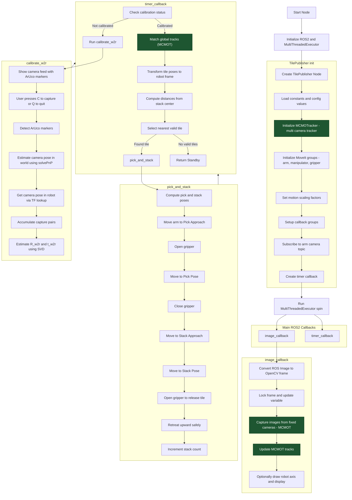

# TilePublisher Node Workflow

```mermaid

flowchart TD

A[Start Node] --> B[Initialize ROS2 and MultiThreadedExecutor]
B --> C[Create TilePublisher Node]

subgraph INIT["TilePublisher init"]
  C1[Load constants and config values]
  C2["Initialize MCMOTracker - multi camera tracker"]
  C3[Initialize MoveIt groups - arm, manipulator, gripper]
  C4[Set motion scaling factors]
  C5[Setup callback groups]
  C6[Subscribe to arm camera topic]
  C7[Create timer callback]
  C --> C1 --> C2 --> C3 --> C4 --> C5 --> C6 --> C7
end

C7 --> D[Run MultiThreadedExecutor spin]

subgraph CALLBACKS["Main ROS2 Callbacks"]
  D1[image_callback]
  D2[timer_callback]
end

D --> D1
D --> D2

subgraph IMAGE_CALLBACK["image_callback"]
  I1[Convert ROS Image to OpenCV frame]
  I2[Lock frame and update variable]
  I3["Capture images from fixed cameras - MCMOT"]
  I4["Update MCMOT tracks"]
  I5[Optionally draw robot axis and display]
  D1 --> I1 --> I2 --> I3 --> I4 --> I5
end

subgraph TIMER_CALLBACK["timer_callback"]
  T1[Check calibration status]
  T1 -->|Not calibrated| T2[Run calibrate_w2r]
  T1 -->|Calibrated| T3["Match global tracks (MCMOT)"]
  T3 --> T4[Transform tile poses to robot frame]
  T4 --> T5[Compute distances from stack center]
  T5 --> T6[Select nearest valid tile]
  T6 -->|Found tile| T7[pick_and_stack]
  T6 -->|No valid tiles| T8[Return Standby]
end

subgraph PICK_AND_STACK["pick_and_stack"]
  P1[Compute pick and stack poses]
  P2[Move arm to Pick Approach]
  P3[Open gripper]
  P4[Move to Pick Pose]
  P5[Close gripper]
  P6[Move to Stack Approach]
  P7[Move to Stack Pose]
  P8[Open gripper to release tile]
  P9[Retreat upward safely]
  P10[Increment stack count]
  T7 --> P1 --> P2 --> P3 --> P4 --> P5 --> P6 --> P7 --> P8 --> P9 --> P10
end

subgraph CALIBRATION["calibrate_w2r"]
  C1a[Show camera feed with ArUco markers]
  C2a[User presses C to capture or Q to quit]
  C3a[Detect ArUco markers]
  C4a[Estimate camera pose in world using solvePnP]
  C5a[Get camera pose in robot via TF lookup]
  C6a[Accumulate capture pairs]
  C7a[Estimate R_w2r and t_w2r using SVD]
  T2 --> C1a --> C2a --> C3a --> C4a --> C5a --> C6a --> C7a
end

CALIBRATION --> TIMER_CALLBACK
PICK_AND_STACK --> TIMER_CALLBACK

%% 🌿 Dark green style with white text for all MCMOT-related nodes
style C2 fill:#1e5631,stroke:#0b3d1d,stroke-width:1.5px,color:#ffffff
style I3 fill:#1e5631,stroke:#0b3d1d,stroke-width:1.5px,color:#ffffff
style I4 fill:#1e5631,stroke:#0b3d1d,stroke-width:1.5px,color:#ffffff
style T3 fill:#1e5631,stroke:#0b3d1d,stroke-width:1.5px,color:#ffffff


```
