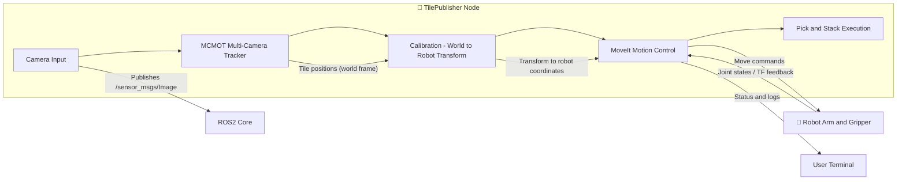

```mermaid

flowchart LR
  subgraph ROS2_Node["🧠 TilePublisher Node"]
    direction LR
    A["Camera Input"] --> B["MCMOT Multi-Camera Tracker"]
    B --> C["Calibration - World to Robot Transform"]
    C --> D["MoveIt Motion Control"]
    D --> E["Pick and Stack Execution"]
  end

  A -->|"Publishes /sensor_msgs/Image"| ROS["ROS2 Core"]
  B -->|"Tile positions (world frame)"| C
  C -->|"Transform to robot coordinates"| D
  D -->|"Move commands"| Arm["🤖 Robot Arm and Gripper"]
  Arm -->|"Joint states / TF feedback"| D
  D -->|"Status and logs"| UI["User Terminal"]


```